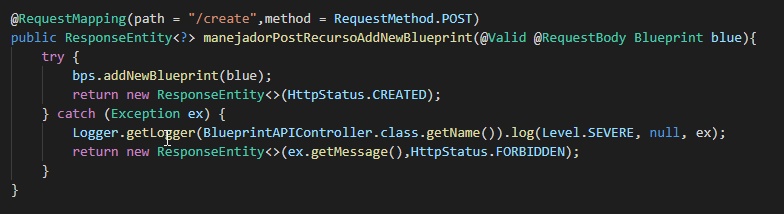
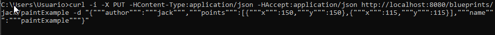

# Lab04-ARSW

# PART I

- Integrate to the base project supplied the Beans developed in the previous exercise. Just copy the classes, NOT the configuration files. Rectify that the dependency injection scheme is correctly configured with the @Service and @Autowired annotations.

- Modify the persistence bean InMemoryBlueprintPersistence so that by default it is initialized with at least three other planes, and with two associated with the same author.

- Configure your application to offer the resource /blueprints, so that when a GET request is made, return in JSON format  all the drawings. For this:
  - Modify the BlueprintAPIController class taking into account the following example of a REST controller made with SpringMVC/SpringBoot
  - Have the BlueprintServices type bean injected into this class (which, in turn, will be injected with its persistence and point     filtering dependencies).
  
  

- Modify the controller so that it now accepts GET requests to the resource /blueprints/{author}, which returns using a JSON representation all the plans made by the author whose name is {author}. If there is no such author, you must respond with the HTTP error code 404. For this, review in the Spring documentation, section 22.3.2, the use of @PathVariable. Again, verify that when making a GET request -for example- to the resource http://localhost:8080/blueprints/juan, the set of planes associated with the author 'juan' is obtained in JSON format (adjust this to the names of author used in point 2).

- Modify the controller so that it now accepts GET requests to the resource/blueprints/{author}/{bpname}, which returns using a JSON representation only ONE plane, in this case the one made by {author} and whose name is {bpname}. Again, if there is no such author, you must respond with the HTTP 404 error code.

# Part II

* Post

Con el fin de que se pudiera ingresar un bluePrint por medio de una petcion Post a la aplicaicon se crea el sigueinte metodo:

Por medio del comando unix curl podemos ingresar un objeto Bluerpint por medio del formato JSON como se muestra en la sigueinte imagen.

Dandonos los siguientes resultados 

--

* Put 

Con el fin de que se pudiera actualizar puntos en un blueprint es necesario realizar un nuevo metodo

Ademas es necesario mandar por paramteros el nombre del autor lo mismo que el nombre de la pintura con el fin de actualizar los puntos
Cabe mecionar que el usuario debe existir y debe tener esa pintura para poder realizar este metodo.

Antes el usuario jack en la pintura paintExmaple tenia punto 140,140 en el primero y luego paso a 150,150 Como podemos verlo en la sigueinte imagen

--

# Part III

* What race conditions could occur? 

una condicion de carrera se da cunado se actualiza la fuente principal de guardado de los datos, el cual es el hashMap 
Que contiene todos los blueprint con su respectivo nombre y autor. dandonos certeza que si piorizamos esta problematica no 
deberia existir este evento de condicion de carrera por un recurso.

* What are the respective critical regions? 

la region critca se da cada vez que se realiza un llamado a este HashMap ya sea para consulta o para ingresar un nuevo elemento a la estructura de datos.
Para este caso casi en cada metodo toca sincronizar el hashmap con el fin de garantizar que no hallan condiciones de carrera por el recurso 

se puede observar en la siguiente imagen:

cabe resaltar que esta modificcion se debe realizar desde la calse InMemoryBluePrintsPersistence ya que esta es donde se enceuntra la estructura de datos. 
